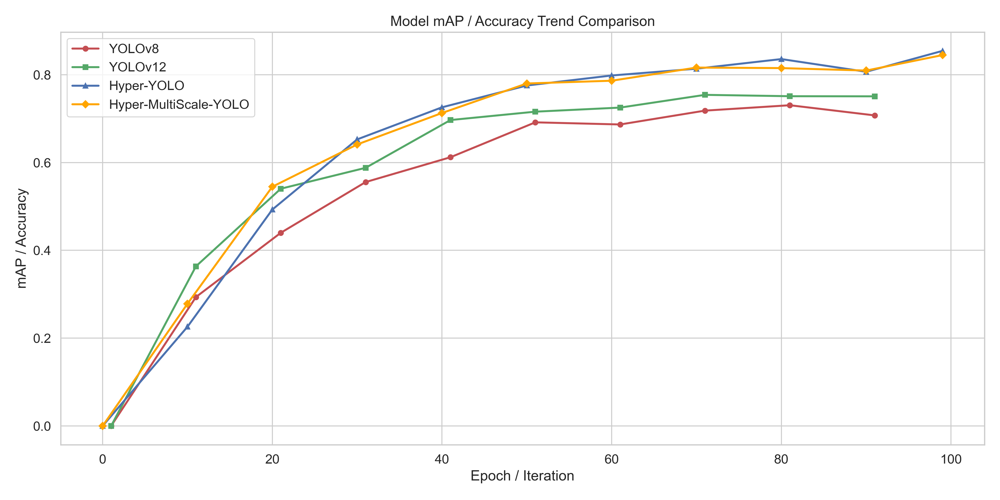
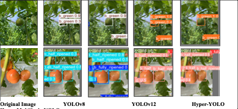
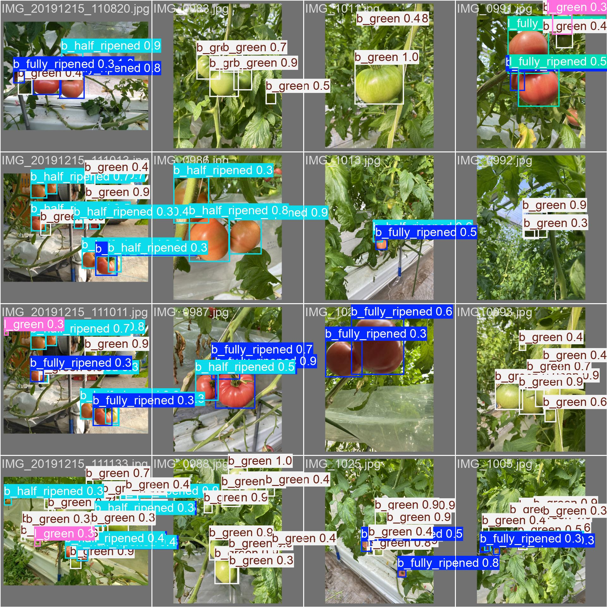

# Hypergraph-YOLOv9-MultiScale

This repository contains an improved Hyper-YOLOv1.1 / YOLOv9 detector for tomato detection. The main change is a new multi-scale convolution detection head, `DualDDetectMultiScale`, which adds parallel 3x3, 5x5, and 7x7 convolution branches to the original Hyper-YOLO detection head.

The project focuses on experiments with the [Laboro Tomato dataset on Kaggle](https://www.kaggle.com/datasets/nexuswho/laboro-tomato). The report used for this README is `AIT2209089_report.docx`, which compares YOLOv8, YOLOv12, Detectron2, Hyper-YOLO, and the proposed Hypergraph-YOLOv9-MultiScale variant.

## Highlights

- Adds `MultiScaleConv` to enrich local receptive fields in the Hyper-YOLO detection head.
- Keeps the original Hyper-YOLO baseline available as `models/detect/yolov9-s-hyper.yaml`.
- Adds a separate multi-scale configuration: `models/detect/yolov9-s-hyper-multi-scale.yaml`.
- Evaluates the model on a 6-class tomato ripeness detection task.
- Provides training curves and prediction examples from the project report.

## Model Change

The baseline model uses the original dual DFL detection head:

```yaml
models/detect/yolov9-s-hyper.yaml
```

The improved model uses the new multi-scale head:

```yaml
models/detect/yolov9-s-hyper-multi-scale.yaml
```

In code, the new path is:

```text
models/yolo.py
  MultiScaleConv
  DualDDetectMultiScale
```

`MultiScaleConv` applies three convolution branches with kernel sizes 3, 5, and 7, sums their outputs, and applies `SiLU`. `DualDDetectMultiScale` then uses this block in the regression and classification branches of the dual detection head.

## Dataset

The dataset used in the report is [Laboro Tomato](https://www.kaggle.com/datasets/nexuswho/laboro-tomato) from Kaggle.

Local dataset layout used in this project:

```text
archive/
  tomato.yaml
  train/
    images/
    labels/
  val/
    images/
    labels/
  annotations/
```

Dataset split found in the local `archive/` folder:

| Split | Images | Labels |
| --- | ---: | ---: |
| Train | 643 | 643 |
| Validation | 161 | 161 |

Classes in `archive/tomato.yaml`:

| ID | Class |
| ---: | --- |
| 0 | `b_fully_ripened` |
| 1 | `b_half_ripened` |
| 2 | `b_green` |
| 3 | `l_fully_ripened` |
| 4 | `l_half_ripened` |
| 5 | `l_green` |

Example dataset config:

```yaml
path: /path/to/archive
train: train/images
val: val/images
nc: 6
names:
  - b_fully_ripened
  - b_half_ripened
  - b_green
  - l_fully_ripened
  - l_half_ripened
  - l_green
```

## Results From Report

The table below summarizes the evaluation reported in `AIT2209089_report.docx`.

| Model | Input Size | mAP@50 | mAP@50:95 | Params | FLOPs | FPS |
| --- | ---: | ---: | ---: | ---: | ---: | ---: |
| YOLOv8 | 640 | 77.6% | 60.1% | 3.0M | 8.2G | 256 |
| YOLOv12 | 640 | 76.0% | 57.9% | 2.57M | 6.5G | 88 |
| Detectron2-0.6 | 640 | 69.6% | 55.4% | 107.03M | 157.33G | 16.34 |
| Hyper-YOLOv9s | 640 | 85.4% | 69.2% | 1.4M | - | 35 |
| Hyper-MultiScale-YOLO | 640 | 84.5% | 68.1% | 3.9M | - | 32 |

The final report shows that the original Hyper-YOLO baseline has the best final mAP on this dataset, while the multi-scale version remains highly competitive and improves early training behavior. This makes the added module useful as an ablation target: it tests whether explicit multi-scale receptive fields can complement Hyper-YOLO's hypergraph feature fusion.

Early-epoch ablation from the report:

| Model | 5 Epoch mAP@50 | 5 Epoch mAP@50:95 | 10 Epoch mAP@50 | 10 Epoch mAP@50:95 | 15 Epoch mAP@50 | 15 Epoch mAP@50:95 |
| --- | ---: | ---: | ---: | ---: | ---: | ---: |
| Hyper-YOLO | 0.0164 | 0.00604 | 0.226 | 0.135 | 0.351 | 0.230 |
| Hyper-MultiScale-YOLO | 0.0515 | 0.0213 | 0.278 | 0.179 | 0.417 | 0.277 |

## Training Trend

The following curve is extracted from the project report. It compares YOLOv8, YOLOv12, Hyper-YOLO, and Hyper-MultiScale-YOLO during training.



## Qualitative Comparison

The following comparison image shows the same tomato samples evaluated by different detectors. It highlights the visual differences among YOLOv8, YOLOv12, Hyper-YOLO, and the improved Hypergraph-YOLOv9-MultiScale model.



## Prediction Examples

The following prediction grid is also extracted from the report and shows tomato detection examples with ripeness labels.



## Installation

Create a Python environment and install the project dependencies:

```bash
conda create -n hyper-yolo-ms python=3.8
conda activate hyper-yolo-ms
pip install -r requirements.txt
```

Alternatively:

```bash
conda env create -f environment.yaml
```

## Training

Train the original Hyper-YOLO baseline:

```bash
python train_dual.py \
  --workers 8 \
  --device 0 \
  --batch 16 \
  --data /path/to/archive/tomato.yaml \
  --img 640 \
  --cfg models/detect/yolov9-s-hyper.yaml \
  --weights '' \
  --name hyper_yolo_tomato \
  --hyp data/hyps/hyp.scratch-low.yaml \
  --epochs 100
```

Train the improved multi-scale model:

```bash
python train_dual.py \
  --workers 8 \
  --device 0 \
  --batch 16 \
  --data /path/to/archive/tomato.yaml \
  --img 640 \
  --cfg models/detect/yolov9-s-hyper-multi-scale.yaml \
  --weights '' \
  --name hyper_multiscale_yolo_tomato \
  --hyp data/hyps/hyp.scratch-low.yaml \
  --epochs 100
```

The report used image size 640, 100 epochs, SGD-style training settings, and Google Colab L4 GPU resources.

## Evaluation

Evaluate a trained multi-scale checkpoint:

```bash
python val_dual.py \
  --data /path/to/archive/tomato.yaml \
  --img 640 \
  --batch 16 \
  --conf 0.001 \
  --iou 0.7 \
  --device 0 \
  --weights runs/train/hyper_multiscale_yolo_tomato/weights/best.pt \
  --name hyper_multiscale_yolo_tomato_val
```

Run detection:

```bash
python detect_dual.py \
  --source /path/to/archive/val/images \
  --img 640 \
  --device 0 \
  --weights runs/train/hyper_multiscale_yolo_tomato/weights/best.pt \
  --name hyper_multiscale_yolo_tomato_detect
```

## Original Paper Reference

This work is based on Hyper-YOLOv1.1 and YOLOv9. The original Hyper-YOLO paper should be used as the theoretical background for hypergraph computation, HyperC2Net, and the original detection architecture:

- Paper: [Hyper-YOLO: When Visual Object Detection Meets Hypergraph Computation](https://www.arxiv.org/abs/2408.04804)
- Original project: [iMoonLab/Hyper-YOLO](https://github.com/iMoonLab/Hyper-YOLO)
- YOLOv9 project: [WongKinYiu/yolov9](https://github.com/WongKinYiu/yolov9)

If you cite the original Hyper-YOLO method, use:

```bibtex
@article{feng2024hyper,
  title={Hyper-YOLO: When Visual Object Detection Meets Hypergraph Computation},
  author={Feng, Yifan and Huang, Jiangang and Du, Shaoyi and Ying, Shihui and Yong, J. H. and Li, Yipeng and Ding, Guiguang and Ji, Rongrong and Gao, Yue},
  journal={IEEE Transactions on Pattern Analysis and Machine Intelligence},
  year={2025},
  publisher={IEEE}
}
```

## Notes

The repository does not include the Kaggle dataset or trained weights. Download the dataset from Kaggle, place it as `archive/`, and update the dataset YAML path before training.
